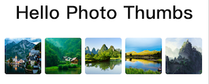
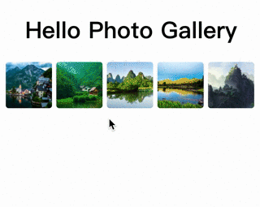

# React-Photo-Gallery
[](https://badge.fury.io/js/react-thumb-photo-gallery)

`react-thumb-photo-gallery` solve two problems:
1. display image thumbs



2. view original picture after click the thumb image



#### Online Demo
[](https://codesandbox.io/s/react-thumb-photo-gallery-demo-ibbvf?autoresize=1&fontsize=14&view=preview)

### Usage

1. PhotoGallery
```
import PhotoGallery from 'react-thumb-photo-gallery'

<PhotoGallery photos={photos} margin={6} radius={4} />
```

2. PhotoThumbs
```
import { PhotoThumbs } from 'react-thumb-photo-gallery'

<PhotoThumbs photos={photos} margin={6} radius={4} />
```

`PhotoThumbs` only handle thumbs without `photoswipe` integration, so it has smaller package size.

### What this package did

`PhotoViewer` is based on [photoswipe](https://github.com/dimsemenov/PhotoSwipe).
First is solve image original size, `photoswipe` only works with correct width and height of images. Unfortunately, we always don't have the image original size.

Second is layout style, thumb have margin between others, and there wrapper cannot take more space.


## Components

#### 1. PhotoGallery/PhotoThumbs

**Props**

| Prop Name | Type              | Default   | Description                            |
| --------- | ----------------- | --------- | -------------------------------------- |
| photos    | Array[string]     | []        | Image data set                         |
| size      | Number            | 64        | Thumbnail image size                   |
| width     | Number            | undefined | Thumbnail image width                  |
| height    | Number            | undefined | Thumbnail image height                 |
| direction | 'row' \| 'column' | 'row'     | Thumbnail Direction                    |
| margin    | Number            | undefined | Thumbnail margin                       |
| srcPrefix | String            | undefined | Add prefix string for each photo src |
| imagePlaceholder | String            | undefined | default image for gallery item |
| itemClass | String            | undefined | add class for gallery item |
| radius | String            | undefined | quick set image border-radius, such as `4` or `'4px'` |
| expandAnimate | boolean       | undefined | only for PhotoGallery, make preview animation start from thumb position |

#### 2. PhotoViewer

`PhotoViewer` is just the wrapper of photoswip for react

```javascript
import { PhotoViewer } from 'react-thumb-photo-gallery'
```

**Props**

| Prop Name | Type               | Default   | Description                             |
| --------- | ------------------ | --------- | --------------------------------------- |
| items     | Array[{src, w, h}] | undefined | Image data set                          |
| options   | Object             | {}        | Props  reference photos props: [Link](https://photoswipe.com/documentation/options.html)   |
